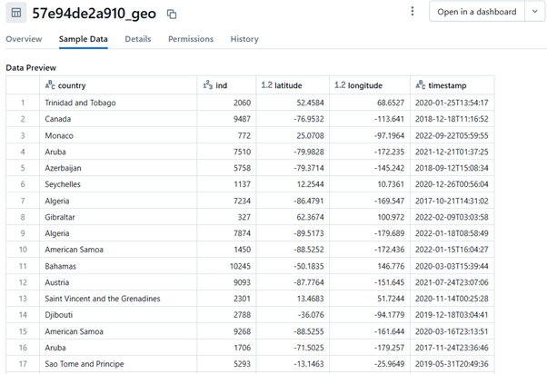
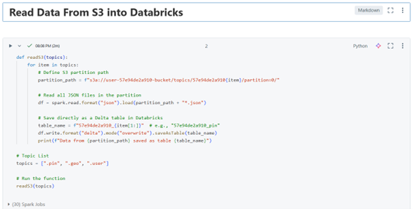

# Pinterest Data Pipeline
Pinterest crunches billions of data points every day to decide how to provide more value to their users. In this project, I will create a similar system using the AWS Cloud.

# Table of Contents
 1. [Project Description](#project-description)
 2. [Installation Instructions](#installation-instructions)
 3. [Usage Instructions](#usage-instructions)
 4. [File Structure of the Project - Milestone 1](#file-structure-of-the-project-milestone-1)
 5. [File Structure of the Project - Milestone 2](#file-structure-of-the-project-milestone-2)
 6. [File Structure of the Project - Milestone 3](#file-structure-of-the-project-milestone-3)
 7. [File Structure of the Project - Milestone 4](#file-structure-of-the-project-milestone-4)
 8. [File Structure of the Project - Milestone 5](#file-structure-of-the-project-milestone-5)
 9. [File Structure of the Project - Milestone 6](#file-structure-of-the-project-milestone-6)
 10. [License Information](#license-information)

# Project Description
Include details of the project here..

# Installation Instructions
The project uses the standard Python installation.

# Usage Instructions
The project can be tested using the main.py

# Project Milestone 1
As part of this project I set up a GitHub repo and created an AWS cloud account. 

# Project Milestone 2
I was provided with a python file containing that contained login details for an RDS database. The database contained three tables containing data resembling data received by the Pinterest API when a POST request was made. 

I moved the login details for the database into a separate db_creds.yaml file and added this file to my .gitignore file so that the details were not uploaded to the github repo. I modify the python script to access the yaml file details and output the following data:
1. pinterest_data contains data about posts being updated to Pinterest
2. geolocation_data contains data about the geolocation of each Pinterest post found in pinterest_data
3. user_data contains data about the user that has uploaded each post found in pinterest_data

I saved copies of data from each table to examine the data stored.

I then signed into the AWS account using the provided credentials, update the password and a made a note of the UserId. In all aspects of the project I will be working in the us-east-1 region so will need to set this region when create new services.

# Project Milestone 3
Using the Parameter Store in the AWS account I found the Key Pair value and stored it in the file Key pair name.pem, locally. This file was also added to the .gitignore file.

After starting the EC2 instance I connected to this instance from VSCode using the SSH client. Once the connection was made I created 3 topics as follows:
1. UserId.pin for the Pinterest posts data
2. UserID.geo for the post geolocation data
3. UserId.user for the post user data

# Project Milestone 4
The API was already created for this project so the first step was to find the API and then create a build a PROXY integration. The resource was created followed by an HTTP ANY method using the PublicDNS of the EC2 machine as the Endpoint URL.
This Endpoint URL was in the following format: http://<ec2 instance PublicDNS>:8082/{proxy}.

The API was then deployed into the Dev stage and the generated Invoke URL was noted to be used in the next step.

Send data to API Gateway.
A copy of the user_posting_emulation.py that was provided to access the data resembling data received by the Pinterest API. This file is called user_posting_emulation_m4.py.
The file was modified as follows:

1. The API Invoke URL and Kafka topics were defined:
# API Invoke URL and Kafka topics
API_URL = "https://<invoke url>/Dev/topics"
HEADERS = {"Content-Type": "application/vnd.kafka.json.v2+json"}

TOPICS = {
    "pinterest_data": "<username>.pin",
    "geolocation_data": "<username>.geo",
    "user_data": "<username>.user"
}

2. The infinite loop was changed to limit the number of records to 500 and a call to the function to send the data to the Kafka REST Proxy was added for each topic area. This was in the following format - post_to_kafka(TOPICS["pinterest_data"], pin_result).

3. The post_to_kafka function was created to send the data to the EC2 and the data was stored in the S3 bucket. 
The first time this program was an error was returned in the following format:

Error posting to Kafka topic <username>.geo: Object of type datetime is not JSON serializable.
This indicated that the data being fetched from the database contained datetime objects, which are not JSON-serializable by default. After researching the error it was clear that the datetime objects needed to be converted to ISO 8601 strings. This was achieved with the follwoing function:

def json_serializer(obj):  
    if isinstance(obj, datetime):  
        return obj.isoformat()  # Convert to ISO 8601 format  
    raise TypeError(f"Type {type(obj)} not serializable")  

Once the serializer had been added the program was run again and the data was sent to the EC2 and could be send in the S3 bucket. The data was stored using the following structure: topics/<username>.<topic name>/partition=0/

**Issues**
The main issue was being able to connect to the Endpoint URL as the first time I set this up I used https instead of http. Having finally realised that this should be http I managed to test the connection using:
curl https://<inoke URL>/Dev/topics/<username>.pin

# Project Milestone 5
Batch Processing: Databricks. 
The first task in this milestone was to setup the Databricks account with the provided details.

The data was then read in from the S3 bucket - when reading in the JSONs from S3, I needed make sure to include the complete path to the JSON objects, as seen in the S3 bucket (e.g topics/<your_UserId>.pin/partition=0/). The path was included in the following format:

s3a://user-<username>-bucket/topics/<username>{item}/partition=0/  

All the data files in the partition were then read into the dataframe:

df = spark.read.format("json").load(partition_path + "*.json")  

The data was then saved directly as a Delta table in Databricks (example below).

The completed code for this task can be found in **milestone5.py**

A screenshot of the code in Databricks can be seen below:

# Project Milestone 6

The evidence for cleaning of the data is found [here](Milestone_6_Cleaning.html)
The evidence for querying the data is found [here](Milestone_6_Query_Data.html)
